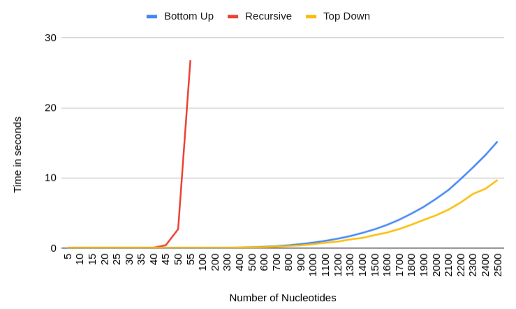
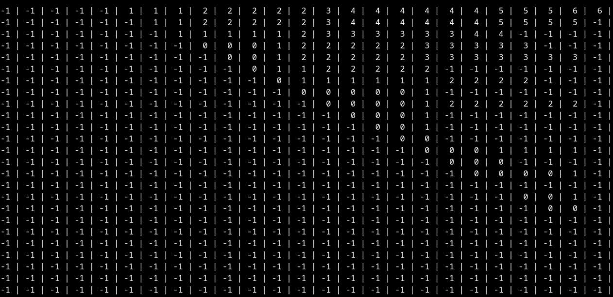
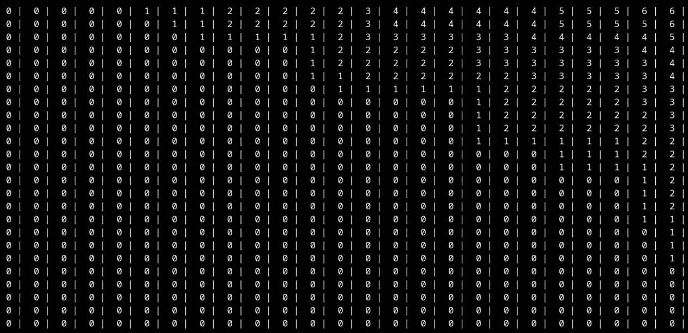

# Analysis

## Performance Comparison

|Number of nucleotides |	Top Down |	Bottom Up	 |Recursive|
|----------------------|-------------|---------------|---------|
|5	| 0	|0	|0|
|10	| 0	|0	|0|
|15	| 0	|0	|0|
|20	| 0	|0	|0|
|25	| 0	|0	|0|
|30	| 0	|0	|0|
|35	| 0	|0	|0.002|
|40	| 0	|0	|0.031|
|45	| 0	|0	|0.394|
|50	| 0	|0	|2.682|
|55	| 0	|0	|26.785|
|100	| 0	|0	| |
|200	| 0.001	|0 | |	
|300	| 0.01	|0.013| |	
|400	| 0.039	|0.04| |
|500	| 0.067	|0.082| |	
|600	| 0.098	|0.153| |	
|700	| 0.186	|0.245| |	
|800	| 0.27	|0.37|	|
|900	| 0.358	|0.541|	|
|1000| 	0.53	|0.745|	|
|1100| 	0.731	|1.004|	|
|1200| 	0.89	|1.307|	|
|1300| 	1.203	|1.667|	|
|1400| 	1.414	|2.13|	|
|1500| 	1.825	|2.647|	|
|1600| 	2.176	|3.269|	|
|1700| 	2.686	|4.01|	|
|1800| 	3.304	|4.889|	|
|1900| 	3.989	|5.859|	|
|2000| 	4.642	|7.002|	|
|2100| 	5.445	|8.246|	|
|2200| 	6.47	|9.815|	|
|2300| 	7.69	|11.47|	|
|2400| 	8.415	|13.207	| |
|2500| 	9.673	|15.18	| |

## Top Down vs Bottom Up

As seen above, the top down version of the algorithm performs better than the bottom up one. This can be attributed to the fact that the bottom up approach is computing all possible dp states before it reaches the desired state, however this is not the case for the top down approach. The top down code computes only the necessary states required in the recursion and thus saves a considerable amount of time when the input is large.

To further elucidate, we present the entries of `RNA::dp` array after the pairs calculation is done.

**Note**: `-1` is the value `RNA::dp` is initialized with, so a cell with `-1` represents an un-computed state.

### Top Down

### Bottom Up

